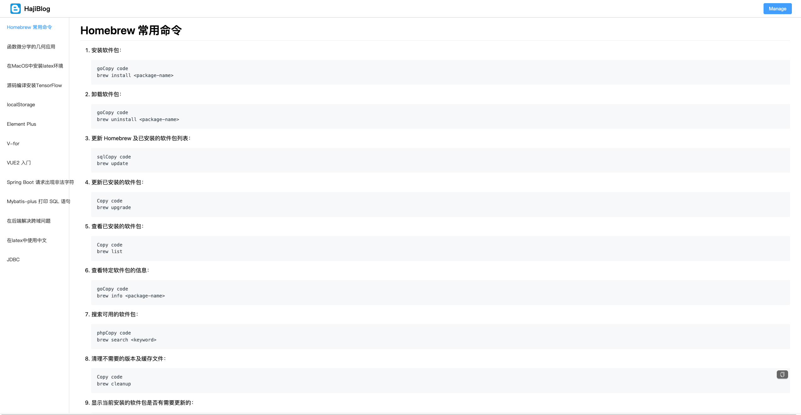
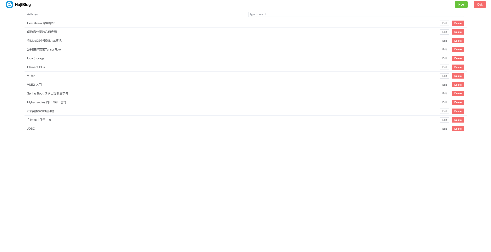
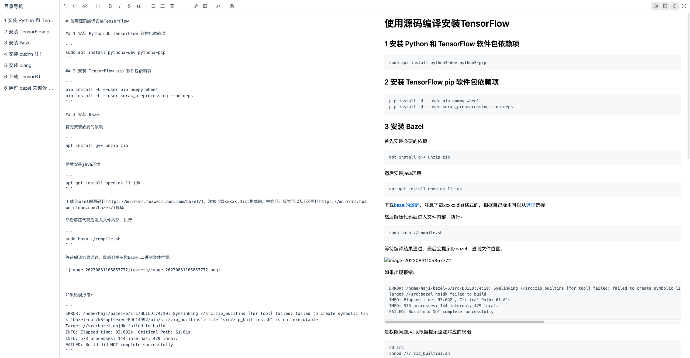
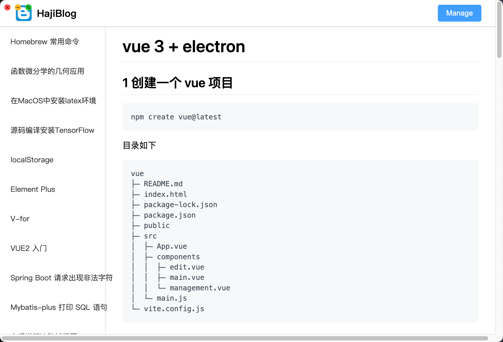

# HajiBlog
一个简单的博客系统







桌面端:



项目结构

```
HajiBlog
├─ .DS_Store
├─ Icon
├─ README.md
├─ server
│  ├─ .idea
│  ├─ HELP.md
│  ├─ mvnw
│  ├─ mvnw.cmd
│  ├─ pom.xml
│  ├─ server.iml
│  ├─ src
│  │  ├─ main
│  │  │  ├─ java
│  │  │  │  └─ haji
│  │  │  │     └─ server
│  │  │  │        ├─ ServerApplication.java
│  │  │  │        ├─ controller
│  │  │  │        │  └─ ArticleController.java
│  │  │  │        ├─ dao
│  │  │  │        │  └─ ArticleDao.java
│  │  │  │        ├─ pojo
│  │  │  │        │  └─ ArticlePojo.java
│  │  │  │        ├─ service
│  │  │  │        │  └─ ArticleService.java
│  │  │  │        └─ util
│  │  │  │           ├─ CORSConfiguration.java
│  │  │  │           └─ TomcatConfig.java
│  │  │  └─ resources
│  │  │     ├─ application.yml
│  │  │     ├─ static
│  │  │     └─ templates
│  │  └─ test
│  │     └─ java
│  │        └─ haji
│  │           └─ server
│  │              └─ ServerApplicationTests.java
│  └─ target
└─ vue
   ├─ .DS_Store
   ├─ .vscode
   │  └─ extensions.json
   ├─ README.md
   ├─ index.html
   ├─ package-lock.json
   ├─ package.json
   ├─ public
   │  ├─ HajiBlog.png
   │  └─ favicon.ico
   ├─ src
   │  ├─ App.vue
   │  ├─ components
   │  │  ├─ edit.vue
   │  │  ├─ main.vue
   │  │  └─ management.vue
   │  └─ main.js
   └─ vite.config.js

```